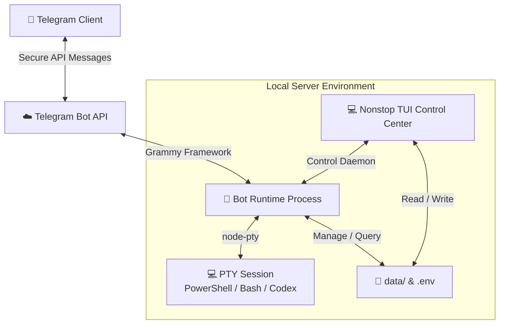

# 🚀 nonstop

[](https://www.typescriptlang.org/)
[](https://opensource.org/licenses/MIT)
[]()

`nonstop` is a terminal control center and background runner for a local, Telegram-driven PTY runtime. It provides a robust root-level CLI/TUI for system management, config tuning, workspace mapping, and OS startup integration, while the Telegram bot securely delegates PTY sessions (PowerShell, Bash, etc.) in the background.

---

## 🌟 Key Features

* **💻 Immersive TUI Control Center** — Manage runtime processes, inspect logs, register workspaces, and edit configuration directly from a command-line interface.
* **🤖 Telegram PTY Terminal** — Execute and control real-time, interactive shell sessions (PowerShell, Bash, Codex, or Antigravity) remotely from Telegram.
* **⚙️ Inline Configuration Engine** — Modify environment settings dynamically through the new `/config` inline Telegram menu or directly in the CLI.
* **📂 Smart Workspaces** — Navigate and switch between different working directories on your machine with a few taps.
* **🔄 Optimized Output Stream** — Advanced batch-delivery mechanics with configurable output intervals, ensuring fluid terminal logs inside Telegram without hitting API limits.
* **🚀 Native OS Autostart** — Easy configuration to run as a background service on OS startup (supports Windows and Linux).
* **🌐 Bilingual Support** — Fully localized in English (`en`) and Vietnamese (`vi`).
* **🛡️ Hardened Security** — Hardened token validation and authorization checks, restricting control access strictly to the configured admin account.

---

## ⚙️ Architecture & Data Flow



---

## 🛠️ Quick Start

### 1. Prerequisites
Ensure you have [Node.js](https://nodejs.org/) (v18+) and `npm` installed.

### 2. Installation
Clone the repository and install the dependencies:
```bash
git clone https://github.com/quangnv13/nonstop.git
cd nonstop
npm install
```

### 3. Build the Application
Compile TypeScript to JavaScript production files:
```bash
npm run build
```

### 5. Run `nonstop`
Launch the interactive terminal-based Control Center:
```bash
npm start
```
> [!NOTE]
> On the first launch, if your `.env` configuration file is missing, `nonstop` will automatically trigger a **Setup Wizard** to configure your Telegram bot token, allowed admin username, client name, language, and startup settings.

For development mode (with hot-reload):
```bash
npm run dev
```

---

## 📁 Repository Layout

```text
nonstop/
├── data/               # Persistent storage (logs, workspaces.json, last-chat-id)
├── src/                # TypeScript source files
│   ├── bot.ts          # Telegram bot handlers & callback commands
│   ├── config.ts       # Config parsers, disk storage, and env bindings
│   ├── runtime.ts      # Shell session controls & PTY managers
│   ├── ui.ts           # TUI Control Center console interface
│   └── index.ts        # App bootstrapper
├── dist/               # Compiled JavaScript files
├── .env                # Runtime environment file (git-ignored)
└── package.json        # Node manifest & scripts
```

---

## 🎛️ Configuration

Configuration is managed via `.env` at the root of the project. You can copy the template from [`.env.example`](.env.example):

```ini
TELEGRAM_BOT_TOKEN=your_telegram_bot_token
ADMIN_USERNAME=@your_telegram_username
TELEGRAM_USERNAME=@your_telegram_username
CLIENT_NAME=nonstop-local
APP_LANGUAGE=en
STARTUP_MODE=disabled
```

### 📱 Managing Config via Telegram
You can easily update settings remotely. In the bot, run the `/config` command or choose **⚙️ Cấu hình / Settings** from the main menu. 

You can dynamically adjust:
* **Token** — Re-starts the bot automatically on token update
* **Admin / Telegram Username** — Access control modifications
* **Startup Mode** — Change startup behaviors (`disabled`, `background`, `open-ui`)
* **Intervals & Limits** — Customize output speeds and line buffers

---

## 📂 Workspace Management

Workspaces let you register directories you frequently access. They are saved in `data/workspaces.json`. 

You can configure them by:
1. Using the **📁 Workspaces** option in the TUI console.
2. Editing the JSON configuration file directly using [workspaces.json.template](data/workspaces.json.template) as a guideline.

---

## 🛡️ Security Best Practices

> [!WARNING]
> Because `nonstop` exposes your machine's shell environments remotely over Telegram, please observe the following security precautions:
>
> 1. **Keep Your Token Secret**: Never commit your `.env` or share your `TELEGRAM_BOT_TOKEN`.
> 2. **Double Check Admin Username**: Ensure `ADMIN_USERNAME` is spelled correctly (include the `@` prefix) to prevent unauthorized access.
> 3. **Least Privilege Principle**: Avoid running the `nonstop` process under highly privileged accounts (like Administrator or root) unless absolutely required.

---

## 📄 License
This project is licensed under the MIT License - see the [LICENSE](LICENSE) file for details.
