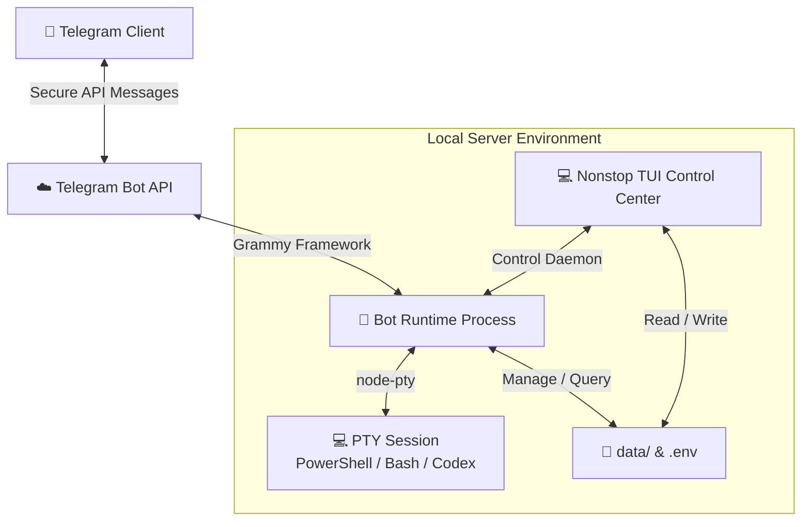

<h1 align="center">🚀 nonstop</h1>

<p align="center">
  🌐 <b>English</b> | 🌐 <a href="./README.vi.md">Tiếng Việt</a> | 🌐 <a href="./README.zh.md">中文</a>
</p>

<p align="center">
  
</p>

[](https://www.typescriptlang.org/)
[](https://opensource.org/licenses/MIT)
[]()

`nonstop` is a terminal control center and background runner for a local, Telegram-driven PTY runtime. It provides a robust root-level CLI/TUI for system management, configuration tuning, workspace mapping, and OS startup integration, while the Telegram bot securely manages background PTY sessions (PowerShell, Bash, etc.).

---

## 📖 Table of Contents

* [🌟 Key Features](#-key-features)
* [⚙️ Architecture & Data Flow](#️-architecture--data-flow)
* [🚀 Quick Start](#-quick-start)
  * [1. Installation](#1-installation)
  * [2. Creating a Telegram Bot](#2-creating-a-telegram-bot)
  * [3. Run and Setup](#3-run-and-setup)
* [🕹️ Usage Guide](#️-usage-guide)
  * [1. Local TUI Control Center](#1-local-tui-control-center)
  * [2. Telegram Bot Interaction](#2-telegram-bot-interaction)
* [🎛️ Configuration](#️-configuration)
* [🛡️ Security Best Practices](#️-security-best-practices)
* [📄 License](#-license)

---

## 🌟 Key Features

* **💻 Immersive TUI Control Center** — Manage runtime processes, inspect logs, register workspaces, and edit configuration directly from a command-line interface.
* **🤖 Telegram PTY Terminal** — Execute and control real-time, interactive shell sessions (PowerShell, Bash, Codex, Antigravity, or Claude) remotely from Telegram.
* **⚙️ Inline Configuration Engine** — Modify environment settings dynamically through the new `/config` inline Telegram menu or directly in the CLI.
* **📂 Smart Workspaces** — Navigate and switch between different working directories on your machine with a few taps.
* **🔄 Optimized Output Stream** — Advanced batch-delivery mechanics with configurable output intervals (`OUTPUT_INTERVAL`) and interaction-triggered flush delays (`ACTION_INTERVAL`), ensuring fluid terminal logs inside Telegram without hitting API limits.
* **🚀 Native OS Autostart** — Easy configuration to run as a background service on OS startup (supports Windows and Linux).
* **🔄 Seamless Remote/Local Switching** — Continue background PTY sessions directly from your computer terminal. The Telegram output sync automatically pauses during active local interaction to prevent rate limits, then flushes a final summary snapshot of the session to Telegram immediately when you detach (via `Ctrl+B` then `D`).
* **⚠️ Dangerous Command Protection** — Intercepts commands matching a customizable list of dangerous patterns and prompts for confirmation (via Telegram inline buttons) before execution, preventing accidental system damage.
* **🌐 Bilingual Support** — Fully localized in English (`en`) and Vietnamese (`vi`).
* **🛡️ Hardened Security** — Hardened token validation and authorization checks that restrict control access strictly to the configured administrator account.


---

## ⚙️ Architecture & Data Flow



---

## 🚀 Quick Start

### 1. Installation
**Prerequisites**: Node.js >= 22.13.0

Install the package globally using npm:
```bash
npm install -g @quangnv13/nonstop
```

### 2. Creating a Telegram Bot
To run `nonstop`, you must obtain a Telegram Bot token. Here is how to create one using `@BotFather`:

1. Open Telegram and search for **@BotFather** (ensure it has the verified blue checkmark).
2. Start a chat and click **Start** (or send the `/start` command).
3. Send the `/newbot` command to initiate the bot creation process.
4. Choose a friendly name for your bot (e.g., `My Nonstop Controller`).
5. Choose a unique username for your bot, which must end in `bot` (e.g., `my_nonstop_bot`).
6. Once created, `@BotFather` will reply with your **HTTP API Access Token** (e.g., `123456789:ABCdefGhIJKlmNoPQRsTUVwxyZ`). Copy this token. Keep it private!

### 3. Run and Setup
Navigate to the directory where you want to store your configuration and run:
```bash
nonstop
```
> [!NOTE]
> On the first launch, if your `.env` configuration file is missing, `nonstop` will automatically start a **Setup Wizard** in your terminal to configure:
> * **Telegram Bot Token**: The token you copied from BotFather.
> * **Allowed Admin Username**: Your Telegram username (starting with `@`) to prevent unauthorized access.
> * **Client Name**: A name to identify this server.
> * **Language**: Choose between English (`en`) and Vietnamese (`vi`).
> * **Startup Mode**: Choose whether it runs on system boot.

---

## 🕹️ Usage Guide

> [!IMPORTANT]
> **No workspaces are auto-generated on first launch.** To start working on any folder, you must first configure/create a workspace mapping to that folder (either via the local TUI Control Center or the Telegram Bot's `📁 Workspaces` menu).

### 1. Local TUI Control Center
Simply run `nonstop` in your terminal to open the management dashboard. From here, you can:
* **Start / Stop** the background bot runtime.
* **Configure Workspaces**: Manage directories where terminal sessions can be started.
* **Attach to Active Sessions**: View and take over background shell sessions (e.g., started from Telegram) directly in your computer's terminal.
* **Autostart Settings**: Set up the application to run automatically on system boot.
* **View Logs**: Monitor bot logs and output in real time.

### 2. Telegram Bot Interaction
Once the bot runtime is active, you can interact with it via the following Telegram interface commands:

#### **📜 Commands**
* `/start` — Bring up the main interactive menu.
* `/status` — View current runtime health (active workspaces, running sessions, presets).
* `/config` — Edit application parameters dynamically.
* `/send <command>` — Send raw input directly to the active session.
* `/help` — Display bot commands and help text.

#### **⚡ Managing PTY Shell Sessions**
1. Select **⚡ Session** from the main menu.
2. Select an environment preset (e.g., **PowerShell**, **Bash**, **Codex**, **Antigravity**, or **Claude**) to start a session.
3. Once running, **enable Input Mode**.
4. Any normal text message you send to the bot (without a leading `/`) will be fed directly into your shell.
5. Use the inline control buttons to send key inputs:
   * **⛔ Esc** — Send the Escape key to interrupt/cancel processes.
   * **⏎ Enter** — Send a carriage return.
   * **▲ Up / ▼ Down** — Navigate command history.
   * **🔄 Refresh** — Request an update of the terminal screen.
   > [!NOTE]
   > Pressing control keys (**Esc**, **Enter**, **Up**, **Down**) or clicking **Refresh** will trigger a quick output delivery after a short interactive delay (configured via `ACTION_INTERVAL`, default 5s) and bypass standard duplicate output filters to guarantee updates are delivered.

#### **📂 Directory Workspaces**
* Select **📁 Workspaces** from the main menu to view configured folders.
* Selecting a workspace sets it as the working directory for your next PTY session.

#### **⚙️ Dynamic Configuration**
* Press **⚙️ Settings** or send `/config`.
* Tap any settings button (e.g. *Token*, *Admin*, *Interval*, etc.) and send a new value via message to apply immediately. 
* If you modify the `Telegram Bot Token`, the bot will automatically reload and restart itself securely.

### 3. Remote/Local Switching
`nonstop` allows you to seamlessly switch control between your Telegram app and your local computer terminal:

1. **Start the Session on Telegram**: Run a session from Telegram bot as usual (e.g., select **⚡ Session** -> **PowerShell**).
2. **Take Over Locally**:
   - Open your computer's terminal and run:
     ```bash
     nonstop
     ```
   - In the TUI, select **List active sessions**.
   - Select the active session you want to connect to.
   - You are now connected directly. Any typing or commands run locally will execute in the same background PTY process.
   - *Note: While you are attached locally, synchronization of new outputs to Telegram is automatically paused to prevent hitting Telegram API rate limits.*
3. **Detach and Return to Telegram**:
   - To disconnect from the local terminal without stopping the process, press **`Ctrl+B` then `D`** (similar to detaching in tmux).
   - `nonstop` will detach, and the session will continue running in the background.
   - Upon detachment, a final summary snapshot of the session's terminal screen is automatically sent to Telegram so you can see the latest status.
   - You can now resume interacting with the session via the Telegram Bot.

---

## 🎛️ Configuration

Configuration is managed via `.env` in the folder where you run the CLI. A template is generated automatically as `.env.example`:

```ini
TELEGRAM_BOT_TOKEN=your_telegram_bot_token
ADMIN_USERNAME=@your_telegram_username
TELEGRAM_USERNAME=@your_telegram_username
CLIENT_NAME=nonstop-local
APP_LANGUAGE=en
STARTUP_MODE=disabled
OUTPUT_INTERVAL=20000
ACTION_INTERVAL=5000
DANGEROUS_COMMAND_CONFIRM=rm -rf /,rm -rf,rm -fr,sudo,del /s,rd /s,rmdir /s,format,shutdown,reboot,poweroff,init 0,dd if=,mkfs,fdisk

# CLI OVERRIDES (Optional)
CODEX_CMD=codex
CODEX_ARGS=[]
ANTIGRAVITY_CMD=agy
ANTIGRAVITY_ARGS=[]
CLAUDE_CMD=claude
CLAUDE_ARGS=[]
```

---

## 🛡️ Security Best Practices

> [!WARNING]
> Because `nonstop` exposes your machine's shell environments remotely over Telegram, please observe the following security precautions:
>
> 1. **Keep Your Token Secret**: Never commit your `.env` or share your `TELEGRAM_BOT_TOKEN`.
> 2. **Double Check Admin Username**: Ensure `ADMIN_USERNAME` is spelled correctly (include the `@` prefix) to prevent unauthorized access.
> 3. **Least Privilege Principle**: Avoid running the `nonstop` process under highly privileged accounts (like Administrator or root) unless absolutely required.

---

## 📄 License
This project is licensed under the MIT License - see the [LICENSE](LICENSE) file for details.
