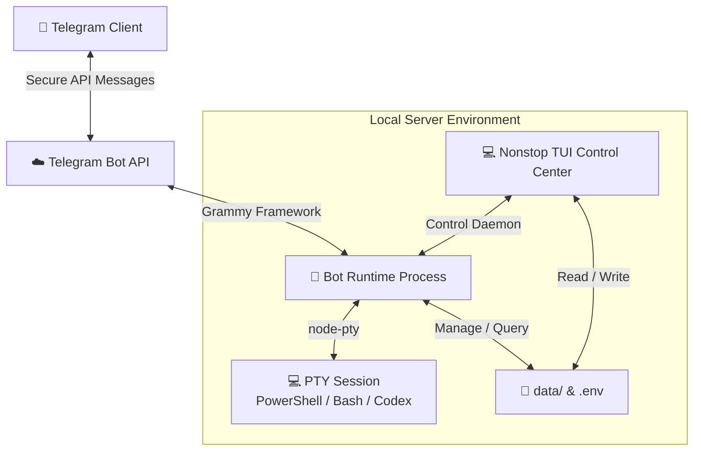

# 🚀 nonstop

[English](./README.md) | 🌐 **Tiếng Việt**

<p align="center">
  
</p>

[](https://www.typescriptlang.org/)
[](https://opensource.org/licenses/MIT)
[]()

`nonstop` là trung tâm điều khiển terminal và tiến trình chạy ẩn cho môi trường PTY cục bộ được điều khiển qua Telegram. Dự án cung cấp giao diện CLI/TUI mạnh mẽ ở cấp root để quản lý hệ thống, tùy chỉnh cấu hình, lập bản đồ thư mục làm việc (workspaces), tích hợp khởi động cùng hệ điều hành, trong khi bot Telegram chạy ẩn thực thi và điều phối các phiên PTY (PowerShell, Bash, v.v.) một cách bảo mật.

---

## 📖 Mục Lục

* [🌟 Tính Năng Nổi Bật](#-tính-năng-nổi-bật)
* [⚙️ Kiến Trúc & Luồng Dữ Liệu](#️-kiến-trúc--luồng-dữ-liệu)
* [🚀 Hướng Dẫn Nhanh](#-hướng-dẫn-nhanh)
  * [1. Cài Đặt](#1-cài-đặt)
  * [2. Tạo Bot Telegram](#2-tạo-bot-telegram)
  * [3. Khởi Chạy và Thiết Lập](#3-khởi-chạy-và-thiết-lập)
* [🕹️ Hướng Dẫn Sử Dụng](#️-hướng-dẫn-sử-dụng)
  * [1. Trung Tâm Điều Khiển TUI Cục Bộ](#1-trung-tâm-điều-khển-tui-cục-bộ)
  * [2. Tương Tác Qua Telegram Bot](#2-tương-tác-qua-telegram-bot)
* [🎛️ Cấu Hình Ban Đầu](#️-cấu-hình-ban-đầu)
* [🛡️ Khuyến Nghị Bảo Mật](#️-khuyến-nghị-bảo-mật)
* [📄 Bản Quyền](#-bản-quyền)

---

## 🌟 Tính Năng Nổi Bật

* **💻 Trung Tâm Điều Khiển TUI Trực Quan** — Quản lý các tiến trình runtime, kiểm tra nhật ký (logs), đăng ký thư mục làm việc và sửa đổi cấu hình trực tiếp từ giao diện terminal.
* **🤖 Terminal PTY Qua Telegram** — Thực thi và điều khiển các phiên shell tương tác thời gian thực (PowerShell, Bash, Codex, Antigravity hoặc Claude) từ xa thông qua Telegram.
* **⚙️ Trình Cấu Hình Động Trực Tiếp** — Thay đổi các tham số môi trường động thông qua menu `/config` bằng các phím inline Telegram hoặc trực tiếp trên CLI.
* **📂 Quản Lý Workspace Linh Hoạt** — Điều hướng và chuyển đổi nhanh chóng giữa các thư mục làm việc khác nhau trên máy chủ cục bộ.
* **🔄 Luồng Đầu Ra Được Tối Ưu Hóa** — Cơ chế gom cụm đầu ra thông minh với khoảng giãn cách cấu hình được (`OUTPUT_INTERVAL`) và độ trễ flush kích hoạt bởi tương tác (`ACTION_INTERVAL`), giúp nhật ký terminal hiển thị mượt mà trên Telegram mà không vượt quá giới hạn API.
* **🚀 Khởi Động Cùng Hệ Điều Hành** — Dễ dàng cấu hình để chạy như một dịch vụ nền khi hệ thống khởi động (hỗ trợ Windows và Linux).
* **⚠️ Bảo Vệ Lệnh Nguy Hiểm** — Tự động chặn và yêu cầu xác thực (thông qua nút bấm inline Telegram) trước khi thực thi các lệnh khớp với danh sách cấu hình, giúp hạn chế rủi ro phá hoại hệ thống ngoài ý muốn.
* **🌐 Hỗ Trợ Đa Ngôn Ngữ** — Bản dịch hoàn chỉnh cho tiếng Anh (`en`) và tiếng Việt (`vi`).
* **🔄 Chuyển Đổi Trực Tiếp/Từ Xa Liền Mạch** — Tiếp tục tương tác trực tiếp với phiên PTY chạy nền ngay từ terminal máy tính. Luồng đồng bộ tin nhắn lên Telegram tự động tạm ngưng khi bạn đang thao tác cục bộ để tránh bị giới hạn API, và tự động gửi 1 tin nhắn tóm tắt trạng thái cuối cùng lên Telegram ngay khi bạn ngắt kết nối (bằng phím tắt `Ctrl+B` rồi `D`).
* **🛡️ Bảo Mật Nghiêm Ngặt** — Xác thực token và kiểm tra quyền hạn chặt chẽ, chỉ cho phép tài khoản Admin đã cấu hình điều khiển hệ thống.


---

## ⚙️ Kiến Trúc & Luồng Dữ Liệu



---

## 🚀 Hướng Dẫn Nhanh

### 1. Cài Đặt
Cài đặt package toàn cục (globally) bằng npm:
```bash
npm install -g @quangnv13/nonstop
```

### 2. Tạo Bot Telegram
Để chạy `nonstop`, bạn cần chuẩn bị một token của bot Telegram. Dưới đây là hướng dẫn tạo bot qua `@BotFather`:

1. Mở ứng dụng Telegram, tìm kiếm **@BotFather** (chú ý chọn tài khoản có dấu tích xanh xác thực).
2. Nhấn **Start** (hoặc gửi lệnh `/start`).
3. Gửi lệnh `/newbot` để bắt đầu quy trình tạo bot mới.
4. Nhập tên hiển thị cho bot của bạn (ví dụ: `My Nonstop Controller`).
5. Nhập tên người dùng (username) duy nhất cho bot, tên này bắt buộc phải kết thúc bằng chữ `bot` (ví dụ: `my_nonstop_bot`).
6. Sau khi hoàn thành, `@BotFather` sẽ gửi lại cho bạn một mã **HTTP API Access Token** (dạng như: `123456789:ABCdefGhIJKlmNoPQRsTUVwxyZ`). Copy lại mã token này và giữ bí mật.

### 3. Khởi Chạy và Thiết Lập
Di chuyển tới thư mục bạn muốn lưu cấu hình nonstop và chạy lệnh:
```bash
nonstop
```
> [!NOTE]
> Trong lần chạy đầu tiên, nếu tệp `.env` chưa tồn tại trong thư mục, `nonstop` sẽ tự động hiển thị **Trình hướng dẫn thiết lập (Setup Wizard)** trực tiếp trên terminal của bạn để giúp bạn điền:
> * **Telegram Bot Token**: Token bạn vừa lấy từ BotFather.
> * **Allowed Admin Username**: Tên người dùng Telegram của bạn (bắt đầu bằng `@`) để ngăn chặn các truy cập trái phép.
> * **Client Name**: Tên định danh cho server này.
> * **Language**: Chọn ngôn ngữ hiển thị (tiếng Anh `en` hoặc tiếng Việt `vi`).
> * **Startup Mode**: Cấu hình tự khởi động cùng hệ điều hành.

---

## 🕹️ Hướng Dẫn Sử Dụng

> [!IMPORTANT]
> **Không có workspace nào được tự động tạo sẵn trong lần chạy đầu tiên.** Để bắt đầu làm việc trên thư mục mong muốn, bạn phải tạo/cấu hình ít nhất một workspace liên kết với thư mục đó (thông qua Trung tâm điều khiển TUI cục bộ hoặc menu `📁 Workspaces` của Bot Telegram).

### 1. Trung Tâm Điều Khiển TUI Cục Bộ
Chỉ cần chạy lệnh `nonstop` trên terminal của bạn để mở giao diện bảng điều khiển. Từ đây bạn có thể:
* **Khởi động / Dừng (Start / Stop)** bot chạy ẩn.
* **Cấu hình Workspace**: Quản lý các thư mục mà phiên terminal được phép khởi chạy từ đó.
* **Kết nối vào phiên hoạt động**: Xem và điều khiển trực tiếp các phiên shell chạy ẩn (ví dụ: được khởi chạy từ Telegram) ngay trên terminal máy tính của bạn.
* **Tự động khởi động (Autostart)**: Thiết lập ứng dụng tự chạy khi hệ thống khởi động.
* **Xem logs**: Theo dõi nhật ký hoạt động của bot thời gian thực.

### 2. Tương Tác Qua Telegram Bot
Khi bot đang hoạt động, bạn có thể tương tác với nó thông qua các lệnh và nút nhấn sau:

#### **📜 Các Lệnh Hệ Thống**
* `/start` — Mở menu chính tương tác.
* `/status` — Xem trạng thái hoạt động (số lượng workspace, các session đang chạy, preset).
* `/config` — Chỉnh sửa các tham số ứng dụng một cách nhanh chóng.
* `/send <lệnh>` — Gửi trực tiếp lệnh dạng văn bản thô tới phiên terminal hiện tại.
* `/help` — Hiển thị hướng dẫn và các lệnh hỗ trợ.

#### **⚡ Quản Lý Các Phiên Shell PTY**
1. Chọn **⚡ Session** từ menu chính.
2. Chọn một môi trường shell (ví dụ: **PowerShell**, **Bash**, **Codex**, **Antigravity**, hoặc **Claude**) để bắt đầu.
3. Khi phiên hoạt động, hãy **bật Chế Độ Nhập (Input Mode)**.
4. Bất kỳ tin nhắn văn bản thông thường nào bạn gửi tới bot (không bắt đầu bằng dấu `/`) sẽ được ghi thẳng vào phiên shell của bạn.
5. Sử dụng các nút bấm trên bàn phím inline để gửi nhanh phím chức năng:
   * **⛔ Esc** — Gửi phím Escape để hủy lệnh/tiến trình đang chạy.
   * **⏎ Enter** — Gửi phím xuống dòng (chấp nhận lệnh).
   * **▲ Up / ▼ Down** — Duyệt lại lịch sử các lệnh đã gõ.
   * **🔄 Tải lại** — Yêu cầu cập nhật màn hình terminal ngay lập tức.
   > [!NOTE]
   > Việc nhấn các phím chức năng (**Esc**, **Enter**, **Up**, **Down**) hoặc nút **Tải lại** sẽ kích hoạt gửi kết quả terminal sau một khoảng trễ ngắn (cấu hình qua `ACTION_INTERVAL`, mặc định là 5 giây) và bỏ qua bộ lọc tin nhắn trùng lặp để đảm bảo bạn thấy kết quả mới nhất.

#### **📂 Thư Mục Làm Việc (Workspaces)**
* Chọn **📁 Workspaces** từ menu chính để xem danh sách các thư mục được cấu hình.
* Việc chọn một workspace sẽ đổi thư mục hiện tại của phiên PTY tiếp theo sang thư mục đó.

#### **⚙️ Cấu Hình Hệ Thống Động**
* Nhấn nút **⚙️ Cấu hình** hoặc gửi lệnh `/config`.
* Nhấn vào bất kỳ trường cấu hình nào (ví dụ: *Token*, *Admin*, *Interval*, v.v.) và gửi giá trị mới thông qua tin nhắn để áp dụng ngay lập tức.
* Khi thay đổi `Telegram Bot Token`, bot sẽ tự động tải lại cấu hình và khởi động lại một cách an toàn.

### 3. Chuyển Đổi Qua Lại Giữa Telegram và Terminal Cục Bộ
`nonstop` cho phép bạn chuyển đổi quyền điều khiển liền mạch giữa ứng dụng Telegram và terminal trên máy tính của bạn:

1. **Khởi chạy phiên trên Telegram**: Bắt đầu một phiên terminal từ bot Telegram như bình thường (ví dụ: chọn **⚡ Session** -> **PowerShell**).
2. **Tiếp quản trực tiếp trên máy tính**:
   - Mở terminal trên máy tính của bạn và chạy:
     ```bash
     nonstop
     ```
   - Trong giao diện TUI, chọn **Danh sách CLI đã spawn**.
   - Chọn phiên đang chạy mà bạn muốn kết nối.
   - Giờ đây bạn đã kết nối trực tiếp. Mọi thao tác gõ phím và lệnh chạy cục bộ sẽ thực thi trên cùng một tiến trình PTY nền đó.
   - *Lưu ý: Trong khi bạn đang kết nối trực tiếp trên máy tính, luồng đồng bộ tin nhắn lên Telegram sẽ tự động tạm ngưng để tránh bị giới hạn API.*
3. **Ngắt kết nối để quay lại Telegram**:
   - Để ngắt kết nối cục bộ mà không dừng tiến trình terminal, nhấn tổ hợp phím **`Ctrl+B` rồi nhấn `D`** (tương tự như detach trong tmux).
   - Ứng dụng sẽ ngắt kết nối trực tiếp, tiến trình shell vẫn tiếp tục chạy ẩn.
   - Ngay sau khi ngắt kết nối, một tin nhắn tóm tắt trạng thái màn hình terminal cuối cùng sẽ được tự động gửi lên Telegram.
   - Bạn có thể tiếp tục tương tác với phiên terminal này qua bot Telegram.

---

## 🎛️ Cấu Hình Ban Đầu

Các cài đặt cấu hình nằm trong file `.env` tại thư mục nơi bạn chạy lệnh CLI. Tệp mẫu cấu hình `.env.example` sẽ được tự động sinh ra:

```ini
TELEGRAM_BOT_TOKEN=your_telegram_bot_token
ADMIN_USERNAME=@your_telegram_username
TELEGRAM_USERNAME=@your_telegram_username
CLIENT_NAME=nonstop-local
APP_LANGUAGE=en
STARTUP_MODE=disabled
OUTPUT_INTERVAL=20000
ACTION_INTERVAL=5000
DANGEROUS_COMMAND_CONFIRM=rm -rf /,rm -rf,rm -fr,sudo,del /s,rd /s,rmdir /s,format,shutdown,reboot,poweroff,init 0,dd if=,mkfs,fdisk

# CLI OVERRIDES (Optional)
CODEX_CMD=codex
CODEX_ARGS=[]
ANTIGRAVITY_CMD=agy
ANTIGRAVITY_ARGS=[]
CLAUDE_CMD=claude
CLAUDE_ARGS=[]
```

---

## 🛡️ Khuyến Nghị Bảo Mật

> [!WARNING]
> Do `nonstop` cung cấp quyền truy cập shell trực tiếp trên máy của bạn thông qua ứng dụng Telegram, hãy lưu ý các quy tắc bảo mật sau:
>
> 1. **Giữ Bí Mật Token Bot**: Tuyệt đối không để lộ tệp `.env` chứa token lên các kho lưu trữ công cộng.
> 2. **Kiểm Tra Kỹ Tên Admin**: Đảm bảo `ADMIN_USERNAME` được điền đúng (bao gồm cả ký tự `@` ở đầu) để tránh kẻ xấu lợi dụng.
> 3. **Chạy Với Quyền Hạn Hạn Chế**: Không nên chạy ứng dụng dưới các quyền quản trị cao nhất (như Administrator hoặc root) trừ khi thực sự cần thiết.

---

## 📄 Bản Quyền
Dự án được cấp phép theo Giấy Phép MIT - xem chi tiết tại tệp [LICENSE](LICENSE).
