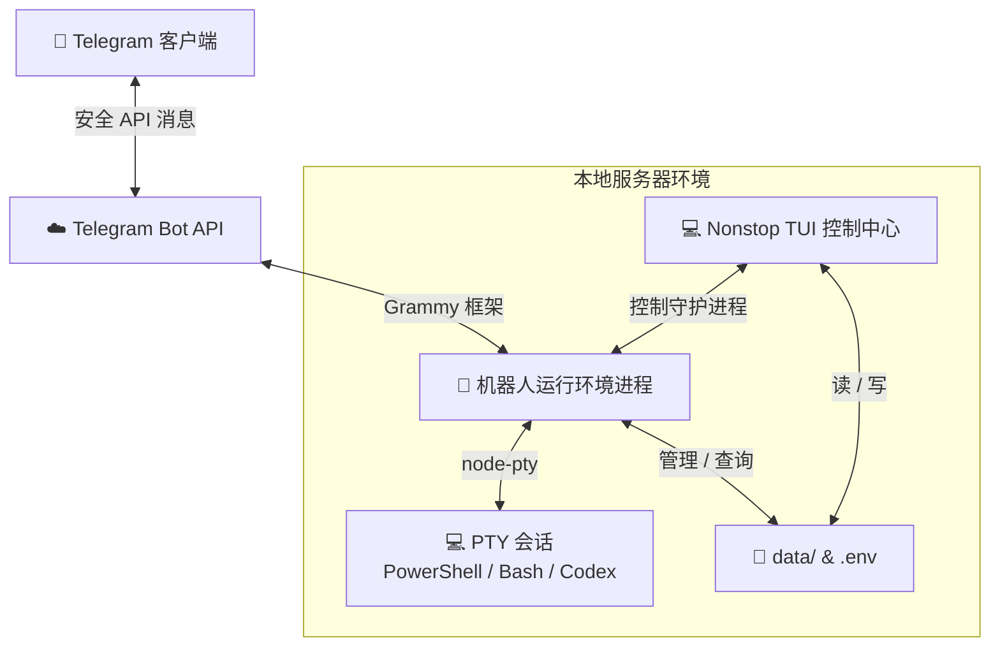

<h1 align="center">🚀 nonstop</h1>

<p align="center">
  🌐 <a href="./README.md">English</a> | 🌐 <a href="./README.vi.md">Tiếng Việt</a> | 🌐 <b>中文</b>
</p>

<p align="center">
  
</p>

[](https://www.typescriptlang.org/)
[](https://opensource.org/licenses/MIT)
[]()

`nonstop` 是一个专为 AI 智能体（AI Agent）和终端会话打造的、由 Telegram 驱动的控制平面（Control Plane）。

可随时随地远程运行并管理 Codex、Claude、Antigravity、Bash、PowerShell 或任何基于 PTY 的工作流，同时在需要时保留无缝的本地接管（Local Takeover）能力。

---

## 📖 目录

* [🌟 核心功能](#-核心功能)
* [⚙️ 架构与数据流](#️-架构与数据流)
* [🚀 快速开始](#-快速开始)
  * [1. 安装](#1-安装)
  * [2. 创建 Telegram 机器人](#2-创建-telegram-机器人)
  * [3. 运行与设置](#3-运行与设置)
* [🕹️ 使用指南](#️-使用指南)
  * [1. 本地 TUI 控制中心](#1-本地-tui-控制中心)
  * [2. Telegram 机器人交互](#2-telegram-机器人交互)
* [🎛️ 配置说明](#️-配置说明)
* [🛡️ 安全最佳实践](#️-安全最佳实践)
* [📄 许可证](#-许可证)

---

## 🌟 核心功能

* **💻 沉浸式 TUI 控制中心** — 直接在命令行界面管理运行环境进程、检查日志、注册工作区并编辑配置。
* **🤖 Telegram PTY 终端** — 从 Telegram 远程执行和控制实时的交互式 Shell 会话（PowerShell、Bash、Codex、Antigravity 或 Claude）。
* **⚙️ 在线配置引擎** — 通过全新的 `/config` 在线 Telegram 菜单或直接在 CLI 中动态修改环境设置。
* **📂 智能工作区** — 轻点几下即可在您机器上的不同工作目录之间进行导航 and 切换。
* **🔄 优化的输出流** — 具有可配置输出间隔（`OUTPUT_INTERVAL`）和交互触发刷新延迟（`ACTION_INTERVAL`）的先进批量交付机制，确保 Telegram 内的终端日志流畅且不触发 API 限制。
* **🚀 原生系统自启动** — 易于配置的在操作系统启动时作为后台服务运行的功能（支持 Windows 和 Linux）。
* **🔄 无缝的远程/本地切换** — 直接从您的电脑终端继续后台 PTY 会话。在本地活动交互期间，Telegram 输出同步会自动暂停以防止触发 rate limit，然后当您分离时（通过 `Ctrl+B` 然后按 `D`）立即向 Telegram 推送会话的最终总结快照。
* **⚠️ 危险命令保护** — 拦截匹配自定义危险模式列表的命令，并在执行前提示确认（通过 Telegram 内联按钮），以防止意外损坏系统。
* **🌐 多语言支持** — 完整本地化，支持英文 (`en`)、越南文 (`vi`) 和中文 (`zh`)。
* **🛡️ 强化的安全性** — 严格的令牌验证和授权检查，限制仅能由配置的管理员账户进行控制。

---

## ⚙️ 架构与数据流



---

## 🚀 快速开始

### 1. 安装
**环境要求**: Node.js >= 22.13.0

使用 npm 全局安装该包：
```bash
npm install -g @quangnv13/nonstop
```

### 2. 创建 Telegram 机器人
要运行 `nonstop`，您必须获取一个 Telegram 机器人令牌。以下是使用 `@BotFather` 创建机器人的方法：

1. 打开 Telegram 并搜索 **@BotFather**（确保它带有蓝色的已验证勾选标记）。
2. 开始对话并点击 **Start**（或发送 `/start` 命令）。
3. 发送 `/newbot` 命令来初始化机器人创建过程。
4. 为您的机器人选择一个友好的名字（例如：`My Nonstop Controller`）。
5. 为您的机器人选择一个唯一的用户名，该用户名必须以 `bot` 结尾（例如：`my_nonstop_bot`）。
6. 创建完成后，`@BotFather` 将回复您的 **HTTP API 访问令牌**（例如：`123456789:ABCdefGhIJKlmNoPQRsTUVwxyZ`）。复制该令牌并妥善保管，切勿公开！

### 3. 运行与设置
导航到您想要存储配置的目录并运行：
```bash
nonstop
```
> [!NOTE]
> 首次启动时，如果缺失 `.env` 配置文件，`nonstop` 将在您的终端中自动启动**设置向导**以进行配置：
> * **Telegram Bot Token**：您从 BotFather 复制的令牌。
> * **Allowed Admin Username**：您的 Telegram 用户名（以 `@` 开头），以防止未经授权的访问。
> * **Client Name**：用于标识此服务器的名称。
> * **Language**：选择英语 (`en`)、越南语 (`vi`) 或中文 (`zh`)。
> * **Startup Mode**：选择是否在系统引导时运行。

---

## 🕹️ 使用指南

> [!IMPORTANT]
> **首次启动时不会自动生成任何工作区。** 要开始在任何文件夹中工作，您必须首先配置/创建一个映射到该文件夹的工作区（通过本地 TUI 控制中心或 Telegram 机器人的 `📁 Workspaces` 菜单）。

### 1. 本地 TUI 控制中心
只需在终端中运行 `nonstop` 即可打开管理仪表板。在这里，您可以：
* **启动 / 停止** 后台机器人运行环境。
* **配置工作区**：管理允许启动终端会话的目录。
* **连接 to 活动会话**：直接在您电脑的终端中查看和接管后台 Shell 会话（例如从 Telegram 启动的会话）。
* **自启动设置**：设置应用程序在系统启动时自动运行。
* **查看日志**：实时监控机器人日志和输出。

### 2. Telegram 机器人交互
一旦机器人运行环境处于活动状态，您可以通过以下 Telegram 界面命令进行交互：

#### **📜 命令**
* `/start` — 调出主要交互式菜单。
* `/status` — 查看当前运行环境健康状态（活动工作区、运行中的会话、预设）。
* `/config` — 动态编辑应用程序参数。
* `/send <command>` — 直接向活动会话发送原始输入。
* `/help` — 显示机器人命令和帮助文本。

#### **⚡ 管理 PTY Shell 会话**
1. 从主菜单中选择 **⚡ Session**。
2. 选择一个环境预设（例如 **PowerShell**、**Bash**、**Codex**、**Antigravity** 或 **Claude**）以启动会话。
3. 会话运行后，**开启输入模式 (Input Mode)**。
4. 您发送给机器人的任何普通文本消息（不以 `/` 开头）都将直接注入到您的 Shell 中。
5. 使用内联控制按钮发送按键输入：
   * **⛔ Esc** — 发送 Escape 键以中断/取消进程。
   * **⏎ Enter** — 发送回车。
   * **▲ Up / ▼ Down** — 导航命令历史记录。
   * **🔄 Refresh** — 请求更新终端屏幕。
   > [!NOTE]
   > 按控制键（**Esc**、**Enter**、**Up**、**Down**）或点击 **Refresh** 将在短暂的交互式延迟（通过 `ACTION_INTERVAL` 配置，默认 5 秒）后触发快速输出交付，并绕过标准的重复输出过滤器以确保更新成功送达。

#### **📂 目录工作区**
* 从主菜单中选择 **📁 Workspaces** 可查看已配置的文件夹。
* 选择一个工作区会将其设置为您下一个 PTY 会话的工作目录。

#### **⚙️ 动态配置**
* 点击 **⚙️ Settings** 或发送 `/config`。
* 点击任何设置按钮（例如 *Token*, *Admin*, *Interval* 等），并通过发送新消息来应用新值，更改将立即生效。
* 如果您修改了 `Telegram Bot Token`，机器人将自动reload并安全地重新启动自身。

### 3. 远程/本地切换
`nonstop` 允许您在 Telegram 应用和本地电脑终端之间无缝切换控制：

1. **在 Telegram 上启动会话**：像往常一样从 Telegram 机器人运行一个会话（例如，选择 **⚡ Session** -> **PowerShell**）。
2. **在本地接管**：
   - 打开您电脑的终端并运行：
     ```bash
     nonstop
     ```
   - 在 TUI 中，选择 **List active sessions**（已生成的会话列表）。
   - 选择您想要连接的活动会话。
   - 现在您已直接连接。本地键入或运行的任何命令都将在同一个后台 PTY 进程中执行。
   - *注意：当您在本地连接时，向 Telegram 同步新输出的进程会自动暂停，以避免超出 Telegram API 的限制。*
3. **分离并返回 Telegram**：
   - 要从本地终端断开连接而不停止进程，请按 **`Ctrl+B` 然后按 `D`**（类似于 tmux 中的 detach）。
   - `nonstop` 将分离，会话将继续在后台运行。
   - 分离后，会话终端屏幕的最终总结快照将自动发送到 Telegram，以便您查看最新状态。
   - 您现在可以恢复通过 Telegram 机器人与会话进行交互。

---

## 🎛️ 配置说明

配置通过运行 CLI 的文件夹中的 `.env` 进行管理。模板作为 `.env.example` 自动生成：

```ini
TELEGRAM_BOT_TOKEN=your_telegram_bot_token
ADMIN_USERNAME=@your_telegram_username
TELEGRAM_USERNAME=@your_telegram_username
CLIENT_NAME=nonstop-local
APP_LANGUAGE=en
STARTUP_MODE=disabled
OUTPUT_INTERVAL=20000
ACTION_INTERVAL=5000
DANGEROUS_COMMAND_CONFIRM=rm -rf /,rm -rf,rm -fr,sudo,del /s,rd /s,rmdir /s,format,shutdown,reboot,poweroff,init 0,dd if=,mkfs,fdisk

# CLI 覆盖配置 (可选)
CODEX_CMD=codex
CODEX_ARGS=[]
ANTIGRAVITY_CMD=agy
ANTIGRAVITY_ARGS=[]
CLAUDE_CMD=claude
CLAUDE_ARGS=[]
```

---

## 🛡️ 安全最佳实践

> [!WARNING]
> 由于 `nonstop` 会通过 Telegram 远程暴露您的机器 Shell 环境，请务必遵守以下安全预防措施：
>
> 1. **保管好您的 Token**：切勿提交您的 `.env` 或共享您的 `TELEGRAM_BOT_TOKEN`。
> 2. **仔细检查管理员用户名**：确保 `ADMIN_USERNAME` 拼写正确（包含 `@` 前缀），以防止未经授权的访问。
> 3. **最小权限原则**：除非绝对需要，否则应避免在具有高度特权的账户（如 Administrator 或 root）下运行 `nonstop` 进程。

---

## 📄 许可证
本项目采用 MIT 许可证授权 - 详情见 [LICENSE](LICENSE) 文件。
