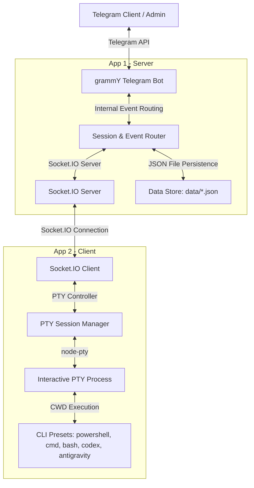

# Remote CLI Telegram Control Platform - Architecture & Design

This document details the system design, architecture, and technology decisions for the Remote CLI Telegram Control Platform.

## 1. High-Level Architecture

The system consists of two primary components communicating over a secure Socket.IO connection, with Telegram serving as the user interface.



## 2. Technology Stack & Design Choices

*   **Runtime:** Node.js LTS (v22+)
*   **Language:** TypeScript (for type safety and compile-time check)
*   **Transport:** Socket.IO (bidirectional, real-time event-driven connection, handles reconnects automatically)
*   **Telegram Bot Framework:** grammY (lightweight, robust, fast)
*   **Terminal Simulation:** `node-pty` (runs real interactive pseudo-terminals, enabling full command input/output streaming, Ctrl+C signals, and confirmation handling)
*   **Persistence:** JSON storage in the `data/` directory (for simple, file-based configuration without database overhead)
    *   `data/admin.json` - Stores the bootstrapped admin user's Telegram ID.
    *   `data/allowed_users.txt` - Text file containing user IDs allowed to interact with the bot (excluding admin-specific system rights).
    *   `data/workspaces.json` - Saves registry of managed client workspaces.
    *   `data/clients.json` - Real-time and persisted metadata of connected clients.

## 3. Communication Protocol (Socket Events)

### Client -> Server
*   `client:hello`: Sent upon connection. Registers the client, its version, hostname, and reports available workspace definitions.
*   `client:status`: Periodic heartbeat/status report.
*   `session:output`: Real-time stdout stream chunks from the PTY session.
*   `session:error`: Streamed stderr or PTY error messages.
*   `session:exit`: Sent when a PTY session terminates, including the exit code.

### Server -> Client
*   `session:start`: Requests spawning a new PTY session using a specific workspace and CLI preset.
*   `session:input`: Sends characters/raw strings to the PTY session (e.g., command texts, responses to prompts).
*   `session:key`: Sends special control keys (e.g., `Ctrl+C`, `Enter`, `Tab`).
*   `session:stop`: Terminates an active PTY session.
*   `session:resize`: Adjusts PTY rows/cols configuration (if needed).
*   `client:ping`: Server-initiated heartbeat check.

## 4. Workspace & PTY Driver Design

To avoid arbitrary `cd` executions, commands are spawn directly within a registered Workspace context:
```typescript
interface Workspace {
  id: string;
  name: string;
  path: string; // Absolute path on the client's host system
}

interface TerminalDriver {
  write(data: string): void;
  resize(cols: number, rows: number): void;
  kill(signal?: string): void;
  onData(cb: (data: string) => void): void;
  onExit(cb: (code: number, signal?: number) => void): void;
}
```

Every workspace directory configuration runs on the machine where the client app is deployed. When starting a session, the client resolves the workspace directory and uses it as `cwd` for `node-pty.spawn()`.

## 5. Security & Admin Model

1.  **Authentication:** Clients connect to the server with a shared secret authorization header/token (`SERVER_CLIENT_AUTH_TOKEN`). If missing or invalid, the connection is instantly closed.
2.  **Admin Ownership:**
    *   If no admin exists in `data/admin.json` and `process.env.ADMIN_USER_ID` is unset, the first Telegram user to send `/start` becomes the admin.
    *   The admin ID is saved to `data/admin.json`.
    *   If `ADMIN_USER_ID` is set in the environment variables, it overrides or initializes the admin context.
3.  **Allowed Users:**
    *   Any other Telegram user trying to communicate with the bot will be rejected as "Unauthorized".
    *   To grant access to other team members, the admin can append their Telegram user IDs to `data/allowed_users.txt` (one ID per line). These users can view and control sessions, but do not possess admin configuration rights (they cannot overwrite the admin credentials).
4.  **Important Security Warning:** Since the bot gives direct access to the client machine's shell (PTY), keeping the bot token, client auth token, and the Telegram admin account secure is absolutely critical. Compromise of the bot or admin Telegram account grants full terminal access.
